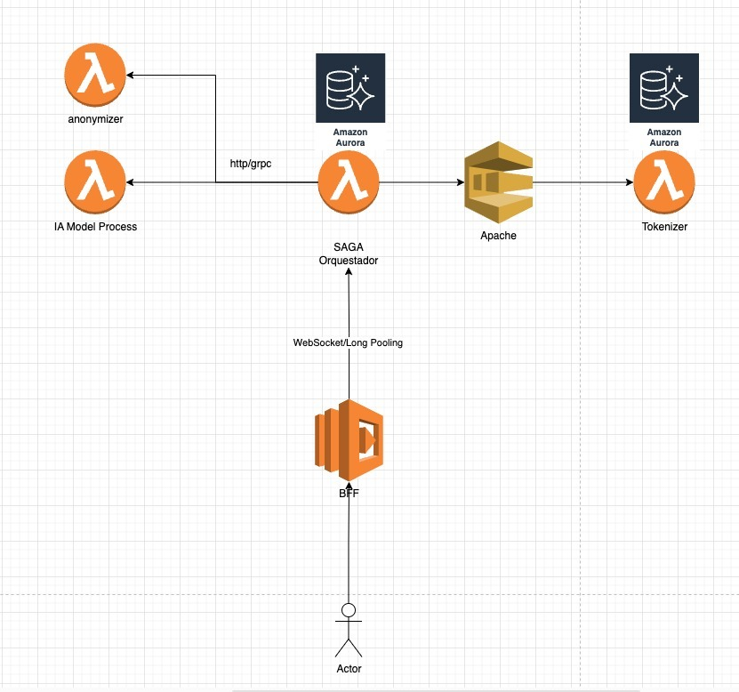

# Entrega



## Estructura del Saga

```
sta-app/
└── src/
    ├── saludtech/
    │   ├── modules/
    │   │   └── sagas/
    │   │       ├── application/
    │   │       │   └── comandos.py         # Comandos para actualizar estado saga
    │   │       └── coordinadores/
    │   │           └── saga_imagenes.py    # Implementación de la saga
    │   └── seedwork/
    │       ├── application/
    │       │   └── sagas.py                # Interfaz base para sagas
    │       └── infrastructure/
    │           ├── pulsar_client.py        # Cliente para integración con Pulsar
    │           └── saga_repository.py      # Repositorio para persistir estados
    └── main.py                             # Punto de entrada - FastAPI
```

## ¿Por qué esta estructura cumple con el patrón SAGA?

1. **Orquestación clara de pasos secuenciales**:
   - La clase `SagaImagenes` en `saga_imagenes.py` orquesta una secuencia de pasos (Step1 → Step2 → Step3) siguiendo el principio fundamental de SAGA: dividir una transacción en pasos más pequeños.

2. **Manejo de compensaciones**:
   - El método `compensate()` implementa el mecanismo para revertir operaciones cuando ocurre un fallo en el Step 3, lo cual es esencial en SAGA.
   - La arquitectura maneja correctamente la compensación selectiva: fallas en Step1/Step2 solo reportan error, mientras que fallas en Step3 desencadenan un evento de compensación.

3. **Persistencia de estado**:
   - El `SagaRepository` gestiona la persistencia del estado de cada SAGA, permitiendo reanudar o consultar el estado de una saga en cualquier momento.
   - El almacenamiento en SQLite facilita saber exactamente en qué paso falló y qué datos se han procesado.

4. **Comunicación entre servicios distribuidos**:
   - La saga utiliza tanto solicitudes HTTP síncronas (para Anonymizer y AI Model) como eventos asíncronos (para Tokenizer), reflejando el comportamiento típico de SAGA en entornos distribuidos.

5. **Idempotencia y consulta asíncrona**:
   - Cada paso actualiza su estado en la base de datos, facilitando la consulta asíncrona del estado general.
   - El endpoint `GET /saga/{saga_id}` permite verificar si la saga se completó, falló o está en progreso.
